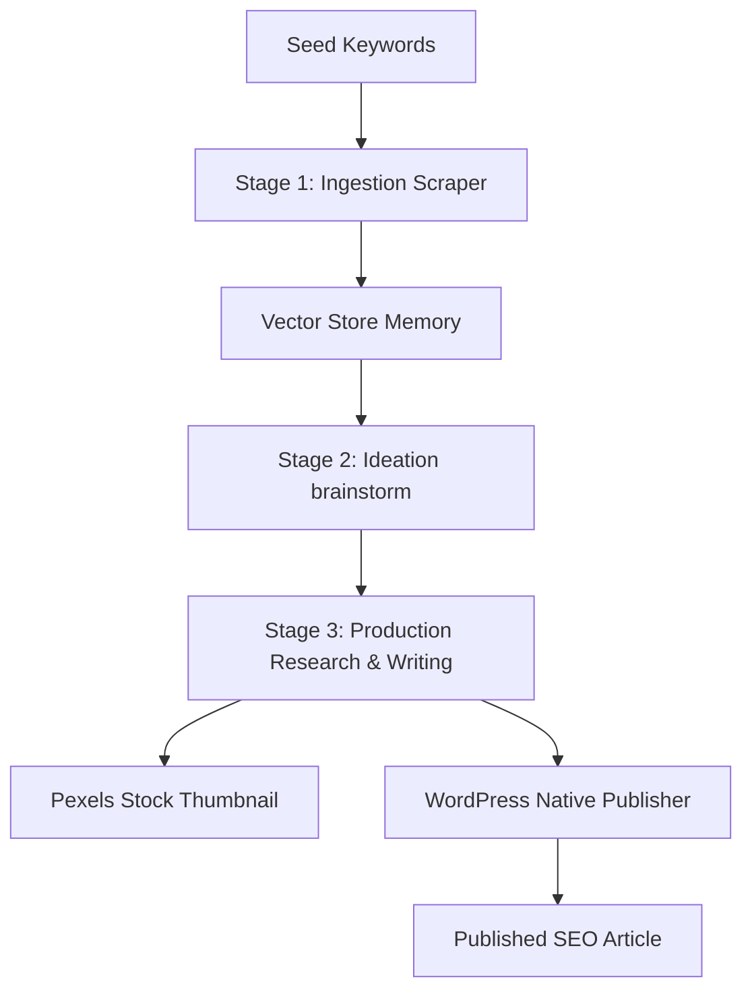

# Autoblog AI for WordPress 🤖✍️

[](https://wordpress.org)
[](https://php.net)
[](LICENSE)
[](#)

An intelligent, agentic autoblogging plugin for WordPress that automates content scraping, brainstorming, deep research, and high-quality SEO-optimized article publishing using advanced LLMs (OpenAI, Google Gemini, Hugging Face, etc.) and semantic search pipelines.

---

## 🌟 Key Features

- **Unified AI Engine Settings**: Select your active LLM provider and configure models in one centralized postbox panel.
- **Dynamic Credentials Table**: Add, remove, and manage API keys and custom endpoints for multiple providers simultaneously.
- **Intra-Provider Multi-API Key Rotation**: Input multiple API keys (one per line). The plugin automatically rotates to backup keys in the pool if the primary key hits a rate limit or quota depletion.
- **Custom Base URL (models.dev Integration)**: Fully customize API endpoints per provider. Default endpoints from `models.dev` are pre-filled as values for instant transparency.
- **Agentic Workflow Pipeline**:
  - **Stage 1 (Ingestion)**: Scrapes news and publications dynamically based on seed keywords using DuckDuckGo Free, SerpApi, or Brave Search.
  - **Stage 2 (Ideation)**: Brainstorms unique, non-trivial post ideas using semantic vector memory to avoid duplicate topics.
  - **Stage 3 (Production)**: Conducts multi-hop web research, compiles taxonomy (categories and tags), generates stock photo featured images (via Pexels/Openverse), and publishes the post.
- **Cross-Provider Smart Fallback**: Automatically switches to backup LLM providers (e.g. Gemini -> OpenAI) if the primary provider fails.
- **Knowledge Base Vector RAG**: Embeds reference documents (PDF, TXT, MD) and fetches context dynamically to improve factual accuracy.

---

## ⚙️ Configuration & Installation

1. Upload the `autoblog-ai-wordpress` directory to your `/wp-content/plugins/` directory.
2. Activate the plugin through the **Plugins** menu in WordPress.
3. Navigate to **Autoblog AI** -> **🤖 AI Settings** in your WordPress admin panel.
4. Add your API credentials:
   - Click **`+ Tambah Key`** to select and add a provider (e.g., Google, OpenAI, Hugging Face).
   - Enter one or more API keys (one per line) in the **API Key(s)** textarea.
   - Select **`Set Aktif`** on the provider you wish to use as the primary writer.
   - Adjust the **AI Model** and other helper service keys (SerpApi, Pexels).
5. Click **Save Changes**.

---

## 🏗 Pipeline Architecture

The plugin executes an autonomous three-stage pipeline to generate authentic blog posts:



1. **Ingestion**: The system searches public indexes, extracts readable clean text, embeds the content, and stores it in a local JSON vector store.
2. **Ideation**: Queries the vector store to check previously covered topics. Brainstorms new, trending article titles that are semantically distinct.
3. **Production**: Uses a multi-round Research Agent to query search engines for facts, updates local taxonomies, inserts context via RAG, downloads featured images, and publishes the post.

---

## 🧪 Testing & Development

The plugin features a robust PHPUnit test suite containing 29 test assertions verifying:
- HTML-to-markdown post-processing and sanitization.
- Vector store JSON serialization and recent topic retrieval.
- Multi-API key rotation and pool parsing.
- Search source input validation and negative filters.

### Running Tests Locally
Due to environmental constraints (e.g., local PHP compilation or FPM-only contexts), you can execute unit tests using the temporary web runner pattern:
1. Create a `tests-runner.php` file in the WordPress root directory pointing to `tests/bootstrap.php`.
2. Run the runner via curl:
   ```bash
   curl -s -k -4 "https://dev.local/tests-runner.php"
   ```
3. Delete the runner script after verification.

---

## 📄 License

This project is licensed under the Custom MIT License with Mandatory Original Repository Attribution - see the [LICENSE](LICENSE) file for details.
