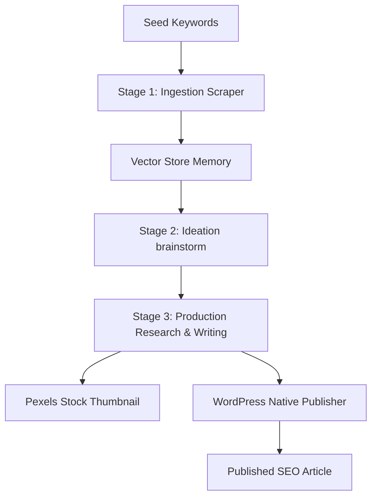

# Autoblog AI for WordPress 🤖✍️

[](https://wordpress.org)
[](https://php.net)
[](LICENSE)
[](#)

An intelligent, agentic autoblogging plugin for WordPress that automates content scraping, brainstorming, deep research, and high-quality SEO-optimized article publishing using advanced LLMs (OpenAI, Google Gemini, Hugging Face, etc.) and semantic search pipelines.

---

## 🌟 Key Features

- **Unified AI Engine Settings**: Select your active LLM provider using the radio button and configure individual AI models for each provider directly in the dynamic table.
- **Dynamic Credentials Table**: Add, remove, and manage API keys and custom endpoints for multiple providers simultaneously.
- **Intra-Provider Multi-API Key Rotation**: Input multiple API keys (one per line). The plugin automatically rotates to backup keys in the pool if the primary key hits a rate limit or quota depletion.
- **Custom Base URL (models.dev Integration)**: Fully customize API endpoints per provider. Default endpoints from `models.dev` are pre-filled as values for instant transparency.
- **Agentic Workflow Pipeline**:
  - **Stage 1 (Ingestion)**: Scrapes news, publications, and **RSS Feeds** dynamically based on seed keywords or RSS URLs using DuckDuckGo Free, SerpApi, or Brave Search.
  - **Stage 2 (Ideation)**: Brainstorms unique, non-trivial post ideas using semantic vector memory to avoid duplicate topics.
  - **Stage 3 (Production)**: Conducts multi-hop web research, compiles taxonomy (categories and tags), generates stock photo featured images (via Pexels/Openverse), and publishes the post.
- **Cross-Provider Smart Fallback**: Automatically switches to backup LLM providers (e.g. Gemini -> OpenAI) if the primary provider fails.
- **Knowledge Base Vector RAG**: Embeds reference documents (PDF, TXT, MD) and fetches context dynamically to improve factual accuracy.

---

## 🖥 Panduan Menu Dashboard Pengaturan (Admin Tabs)

Plugin ini dilengkapi dengan 5 tab pengaturan di halaman admin untuk mengontrol seluruh alur kerja robot penulis (AI Agent):

### 1. 🔑 API Keys (Pengaturan Kunci API & Model)


Di sini Anda mengatur "otak" AI yang akan digunakan untuk menulis:
* **Pilih Provider Aktif**: Cukup klik tombol bulat (radio button) di kolom **Aktif** untuk memilih provider utama (misal: Google Gemini atau OpenAI). Provider terpilih akan bertanda **AKTIF** (hijau), sedangkan yang lain menjadi **CADANGAN** (abu-abu).
* **AI Model Terpisah**: Setiap provider punya pilihan modelnya sendiri langsung di baris tabelnya. Anda bisa set Google Gemini menggunakan `gemini-2.5-pro` dan OpenAI menggunakan `gpt-4o-mini` tanpa saling mengganggu.
* **Rotasi Banyak API Key**: Anda bisa memasukkan banyak API key sekaligus di kolom **API Key(s)** (tulis satu key per baris). Jika key utama Anda limit atau habis kuota, AI akan otomatis memakai key baris di bawahnya tanpa membuat proses menulis berhenti.
* **Base URL Kustom**: Bisa digunakan jika Anda memakai proxy API, server lokal, atau model AI buatan sendiri. Nilai default bawaan dari `models.dev` sudah terisi otomatis.
* **Tombol Uji (Test Connection)**: Klik tombol **Test** di baris provider mana saja untuk langsung mengetes koneksi API key menggunakan model spesifik pilihan di baris tersebut.

### 2. 📥 Data Sources (Sumber Bahan Tulisan)


Menentukan dari mana AI akan mencari bahan referensi sebelum menulis artikel:
* **Mode Sumber Data (Source Mode)**:
  * *Keduanya*: AI akan membaca dokumen di Knowledge Base lokal Anda DAN mencari info tambahan dari internet/RSS.
  * *Hanya KB (Knowledge Base)*: AI hanya akan menulis artikel berdasarkan dokumen-dokumen yang Anda unggah saja (sumber internal).
  * *Hanya Triggers (External)*: AI menulis murni dari internet, RSS Feed, atau web scraper luar saja.
* **Knowledge Base (RAG)**: Unggah file dokumen referensi Anda di sini (mendukung `.xlsx`, `.csv`, `.pdf`, `.docx`, `.txt`, `.md`). Sistem akan memecah dokumen tersebut menjadi potongan memori vektor agar AI bisa menjawab dengan fakta yang tepat.
* **Content Triggers**: Mengatur pemantau konten otomatis:
  * **RSS Feed**: Mengambil berita dari feed RSS blog lain. Jika artikel di feed terlalu pendek, sistem otomatis akan pergi ke link asli dan mengekstrak artikel utamanya secara bersih menggunakan library `Readability`.
  * **Web Scraper**: Menyalin isi halaman web tertentu secara spesifik menggunakan CSS Selector (misalnya hanya mengambil elemen tag `<article>`).
  * **Web Search**: Menyuruh AI mencari topik terpopuler di DuckDuckGo atau SerpApi.
  * **Penyaring Kata Kunci**: Masukkan kata kunci wajib (*Include*) atau kata kunci pantangan (*Exclude*) untuk menyaring artikel agar relevan.

### 3. 👥 Writing Style (Gaya Penulisan & Penulis)


Mengatur "siapa" yang menulis dan "bagaimana" gaya bahasanya:
* **Strategi Penulis (Author Strategy)**: Tentukan akun WordPress mana yang dipasang sebagai penulis artikel baru:
  * *Random*: Diacak di antara user yang terdaftar.
  * *Round Robin*: Bergantian secara adil.
  * *Fixed Author*: Selalu ditulis oleh satu user WordPress yang sama.
* **Hubungkan Penulis ke Persona**: Anda bisa menugaskan Persona AI yang berbeda untuk setiap akun WordPress. Misalnya, akun Budi menggunakan gaya bahasa **Si Santuy**, sedangkan akun Jurnalis menggunakan gaya **Si Profesional**.
* **Personality Fine-Tuning**: Anda bisa menempelkan 2-3 paragraf contoh tulisan asli Anda (*Writing Samples*). Jika diaktifkan, AI akan meniru gaya bahasa, panjang kalimat, hingga gaya humor Anda agar tulisan terlihat lebih orisinal dan natural.
* **Pilihan Persona AI Bawaan**:
  * *Si Kritis*: Skeptis, langsung ke poin utama, benci bahasa iklan.
  * *Si Storyteller*: Mengalir, banyak metafora, seperti ngobrol santai di warkop.
  * *Si Realistis*: Praktis dan fokus pada solusi nyata ("Gini lho...").
  * *Si Santuy*: Bergaya bahasa kasual dan santai ala anak muda Jaksel yang tetap berbobot.
  * *Si Profesional*: Sopan, terstruktur, dan berwibawa layaknya jurnalis senior.

### 4. ⚙️ Advanced (Fitur AI Canggih)


Fitur-fitur tambahan untuk membuat AI bekerja seperti asisten jurnalis profesional:
* **Dynamic Search Agent**: AI tidak hanya mencari kata kunci yang Anda masukkan, tapi juga mengembangkannya secara dinamis menjadi kueri pencarian unik setiap hari (misal: "Tren AI" berkembang menjadi "Tren AI dalam Industri Kesehatan 2025").
* **Deep Research Agent (Riset Mendalam)**: AI akan mencari info di internet secara berulang-ulang (*multi-hop*), menganalisis data sementara, lalu mencari lagi sampai faktanya lengkap sebelum mulai menulis.
* **Autonomous Interlinking**: AI akan memindai artikel-artikel lama di blog Anda secara otomatis dan menyisipkan tautan (link) ke artikel tersebut di dalam postingan baru yang relevan untuk meningkatkan SEO.
* **Living Content (Update Otomatis)**: AI secara berkala akan membaca artikel lama Anda yang sudah usang dan menulis ulang isinya agar tetap segar tanpa mengubah tautan (URL) artikel tersebut.
* **Multi-Modal Content**: Secara otomatis membuat diagram/grafik visual jika artikel membahas data statistik, serta menyisipkan media/video yang relevan.

### 5. 🛠 Tools (Pusat Kendali Agen)


Halaman kontrol taktis untuk melihat kinerja robot AI secara real-time:
* **Visual Agent Flow Diagram**: Grafik visual yang menunjukkan status kerja 3 agen utama Anda: *Collector Agent* (pengumpul data), *Ideator Agent* (pembuat ide), dan *Writer Agent* (penulis artikel). Anda bisa mengklik ikon agen tersebut untuk menjalankannya secara manual.
* **Picu Pipeline Sekarang**: Tombol cepat untuk menyuruh AI langsung mulai mengumpulkan bahan, membuat ide, menulis, dan menerbitkan artikel detik ini juga tanpa menunggu jadwal cron.
* **Penjadwalan Otomatis (Cron)**: Mengatur frekuensi AI menulis otomatis (setiap jam, harian, mingguan, dsb.) dan status postingan default (Draft agar aman, atau langsung Terbit).
* **📟 System Logs (Debug Console)**: Menampilkan konsol log aktivitas teknis AI di balik layar secara langsung untuk melacak error atau memantau rotasi API key.

---

## ⚙️ Configuration & Installation

1. Upload the `autoblog-ai-wordpress` directory to your `/wp-content/plugins/` directory.
2. Activate the plugin through the **Plugins** menu in WordPress.
3. Navigate to **Autoblog AI** -> **🤖 AI Settings** in your WordPress admin panel.
4. Add your API credentials:
   - Click **`+ Tambah Key`** to select and add a provider (e.g., Google, OpenAI, Hugging Face).
   - Enter one or more API keys (one per line) in the **API Key(s)** textarea.
   - Select the radio button under the **Aktif** column on the provider you wish to use as the primary writer.
   - Choose the preferred **AI Model** directly from the dropdown menu in that provider's row.
   - Adjust other helper service keys (SerpApi, Pexels) in the credentials section below.
5. Click **Save Changes**.

---

## 🏗 Pipeline Architecture

The plugin executes an autonomous three-stage pipeline to generate authentic blog posts:



1. **Ingestion**: The system searches public indexes, extracts readable clean text, embeds the content, and stores it in a local JSON vector store.
2. **Ideation**: Queries the vector store to check previously covered topics. Brainstorms new, trending article titles that are semantically distinct.
3. **Production**: Uses a multi-round Research Agent to query search engines for facts, updates local taxonomies, inserts context via RAG, downloads featured images, and publishes the post.

---

## 🧪 Testing & Development

The plugin features a robust PHPUnit test suite containing 29 test assertions verifying:
- HTML-to-markdown post-processing and sanitization.
- Vector store JSON serialization and recent topic retrieval.
- Multi-API key rotation and pool parsing.
- Search source input validation and negative filters.

### Running Tests Locally
Due to environmental constraints (e.g., local PHP compilation or FPM-only contexts), you can execute unit tests using the temporary web runner pattern:
1. Create a `tests-runner.php` file in the WordPress root directory pointing to `tests/bootstrap.php`.
2. Run the runner via curl:
   ```bash
   curl -s -k -4 "https://dev.local/tests-runner.php"
   ```
3. Delete the runner script after verification.

---

## 📄 License
 
This project is licensed under the GPL-2.0-or-later License - see the [LICENSE](LICENSE) file for details.
