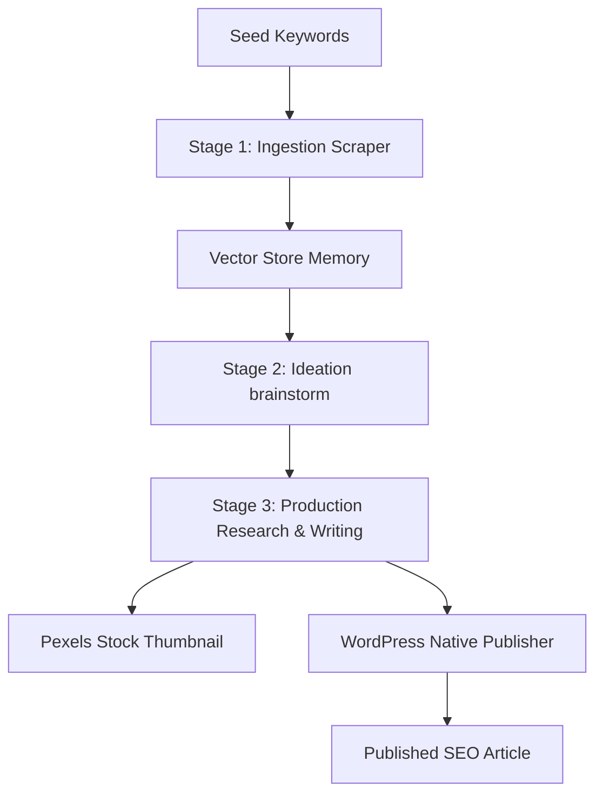

# Autoblog AI for WordPress 🤖✍️

[](https://wordpress.org)
[](https://php.net)
[](LICENSE)
[](#)

An intelligent, agentic autoblogging plugin for WordPress that automates content scraping, brainstorming, deep research, and high-quality SEO-optimized article publishing using advanced LLMs (OpenAI, Google Gemini, Hugging Face, etc.) and semantic search pipelines.

---

## 🌟 Key Features

- **Unified AI Engine Settings**: Select your active LLM provider using the radio button and configure individual AI models for each provider directly in the dynamic table.
- **Dynamic Credentials Table**: Add, remove, and manage API keys and custom endpoints for multiple providers simultaneously.
- **Intra-Provider Multi-API Key Rotation**: Input multiple API keys (one per line). The plugin automatically rotates to backup keys in the pool if the primary key hits a rate limit or quota depletion.
- **Custom Base URL (models.dev Integration)**: Fully customize API endpoints per provider. Default endpoints from `models.dev` are pre-filled as values for instant transparency.
- **Agentic Workflow Pipeline**:
  - **Stage 1 (Ingestion)**: Scrapes news, publications, and **RSS Feeds** dynamically based on seed keywords or RSS URLs using DuckDuckGo Free, SerpApi, or Brave Search.
  - **Stage 2 (Ideation)**: Brainstorms unique, non-trivial post ideas using semantic vector memory to avoid duplicate topics.
  - **Stage 3 (Production)**: Conducts multi-hop web research, compiles taxonomy (categories and tags), generates stock photo featured images (via Pexels/Openverse), and publishes the post.
- **Cross-Provider Smart Fallback**: Automatically switches to backup LLM providers (e.g. Gemini -> OpenAI) if the primary provider fails.
- **Knowledge Base Vector RAG**: Embeds reference documents (PDF, TXT, MD) and fetches context dynamically to improve factual accuracy.

---

## 🖥 Admin Settings Dashboard Tabs

The plugin settings dashboard is organized into 5 tabs, allowing granular control over the agentic workflow:

### 1. 🔑 API Keys
* **Active Provider Radio**: Select the primary LLM provider. The active provider gets highlighted while backup providers are kept as standby.
* **Per-Provider Model Dropdown**: Select the active model for each provider row independently. Models are dynamically populated from the `models.dev` catalog.
* **Multi-API Key Rotation**: Input multiple API keys (one per line) per provider. The plugin automatically rotates to backup keys if the active key hits rate limits or quota depletion.
* **Base URL Customization**: Override default API endpoints for custom proxies, local models, or reverse proxies.
* **Isolated Connection Tester**: Test API keys using the specific model selected on that row.

### 2. 📥 Data Sources
* **Data Source Mode**: 
  * *Both (Knowledge Base + Triggers)*: Combines external scraping with RAG context.
  * *Only KB (Internal)*: Pure internal RAG processing from uploaded documents.
  * *Only Triggers (External)*: Rely strictly on external triggers (RSS, Web Scrapers, Search).
* **Knowledge Base (RAG)**: Upload documents (`.xlsx`, `.csv`, `.pdf`, `.docx`, `.txt`, `.md`) to build a local vector store.
* **Content Triggers**: Configure automated ingestion via **RSS Feeds** (with Readability-based smart scraping fallback), **Web Scrapers** (targeting CSS Selectors), or periodic **Web Search** queries. Includes inclusion/exclusion keyword filters.

### 3. 👥 Writing Style
* **WordPress Author Strategy**: Choose how WordPress author accounts are assigned to new posts (*Random*, *Round Robin*, or *Fixed Author*).
* **Author-to-Persona Mapping**: Map each WordPress author account to a specific **AI Persona** (such as *Si Kritis*, *Si Storyteller*, *Si Realistis*, *Si Santuy*, or *Si Profesional*) and customize author-level writing samples.
* **Personality Fine-Tuning**: Enable custom personality settings and paste writing samples for Few-Shot prompting.
* **Master Persona Management**: Create, view, and delete custom AI personas with custom character instruction prompts.

### 4. ⚙️ Advanced
* **Dynamic Search Agent**: Generates specific daily search queries using base keywords as seeds.
* **Deep Research Agent**: recursive multi-hop internet research (*Search -> Analyze -> Search*) to compile facts.
* **Autonomous Interlinking**: Automatically scan and insert internal links to old posts contextually.
* **Living Content (Auto-Update)**: Periodically refreshes old articles with fresh information without changing URLs.
* **Multi-Modal Content**: Automatically renders visual charts for statistic-heavy posts and embeds media files.

### 5. 🛠 Tools
* **Visual Agent Flow Diagram**: Interactive node-based diagram monitoring the asynchronous pipeline status (Collector -> Ideator -> Writer). Nodes can be clicked to trigger individual stages.
* **Quick Actions & Overrides**: Run the full pipeline immediately with the **Picu Pipeline Sekarang** button, or toggle features globally with override checkboxes.
* **Automated Scheduling (Cron)**: Configure intervals for publishing runs and content refreshing, plus default post statuses.
* **Real-Time Debug Console**: View live system logs and clear log files.

---

## ⚙️ Configuration & Installation

1. Upload the `autoblog-ai-wordpress` directory to your `/wp-content/plugins/` directory.
2. Activate the plugin through the **Plugins** menu in WordPress.
3. Navigate to **Autoblog AI** -> **🤖 AI Settings** in your WordPress admin panel.
4. Add your API credentials:
   - Click **`+ Tambah Key`** to select and add a provider (e.g., Google, OpenAI, Hugging Face).
   - Enter one or more API keys (one per line) in the **API Key(s)** textarea.
   - Select the radio button under the **Aktif** column on the provider you wish to use as the primary writer.
   - Choose the preferred **AI Model** directly from the dropdown menu in that provider's row.
   - Adjust other helper service keys (SerpApi, Pexels) in the credentials section below.
5. Click **Save Changes**.

---

## 🏗 Pipeline Architecture

The plugin executes an autonomous three-stage pipeline to generate authentic blog posts:



1. **Ingestion**: The system searches public indexes, extracts readable clean text, embeds the content, and stores it in a local JSON vector store.
2. **Ideation**: Queries the vector store to check previously covered topics. Brainstorms new, trending article titles that are semantically distinct.
3. **Production**: Uses a multi-round Research Agent to query search engines for facts, updates local taxonomies, inserts context via RAG, downloads featured images, and publishes the post.

---

## 🧪 Testing & Development

The plugin features a robust PHPUnit test suite containing 29 test assertions verifying:
- HTML-to-markdown post-processing and sanitization.
- Vector store JSON serialization and recent topic retrieval.
- Multi-API key rotation and pool parsing.
- Search source input validation and negative filters.

### Running Tests Locally
Due to environmental constraints (e.g., local PHP compilation or FPM-only contexts), you can execute unit tests using the temporary web runner pattern:
1. Create a `tests-runner.php` file in the WordPress root directory pointing to `tests/bootstrap.php`.
2. Run the runner via curl:
   ```bash
   curl -s -k -4 "https://dev.local/tests-runner.php"
   ```
3. Delete the runner script after verification.

---

## 📄 License
 
This project is licensed under the GPL-2.0-or-later License - see the [LICENSE](LICENSE) file for details.
