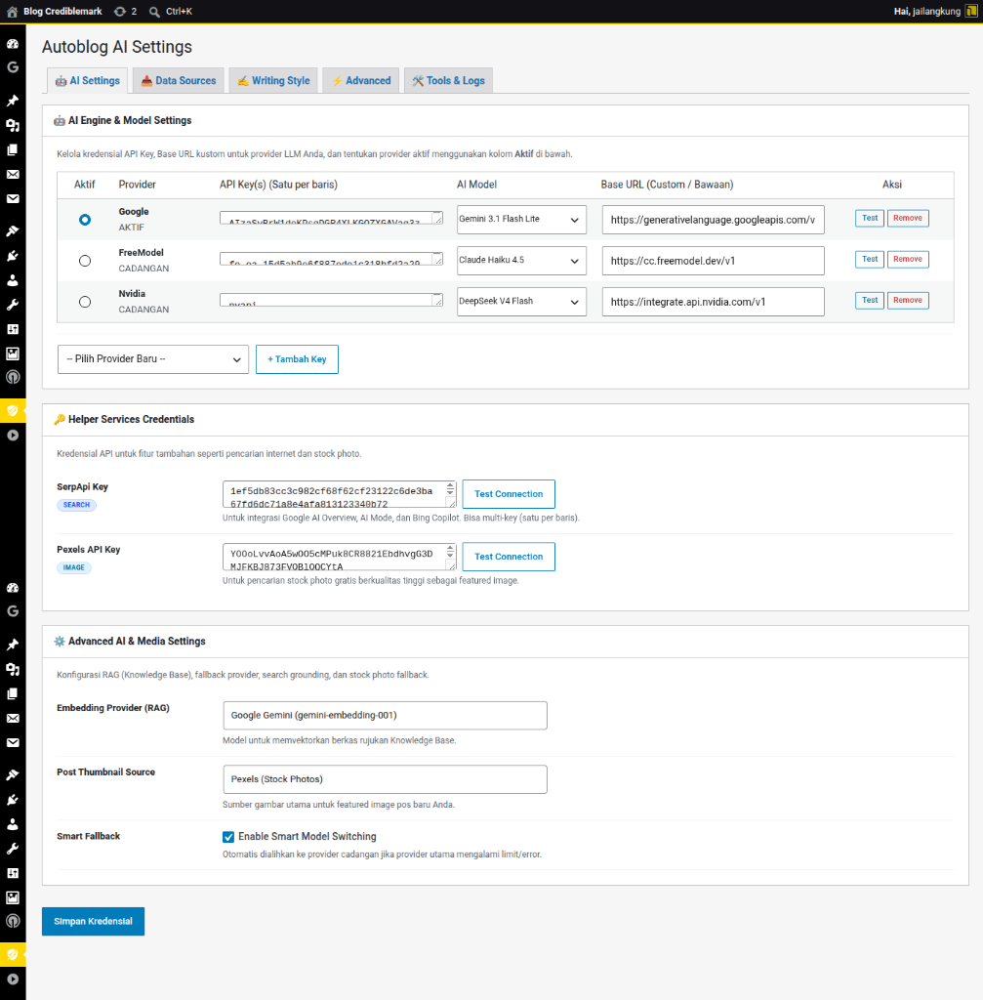
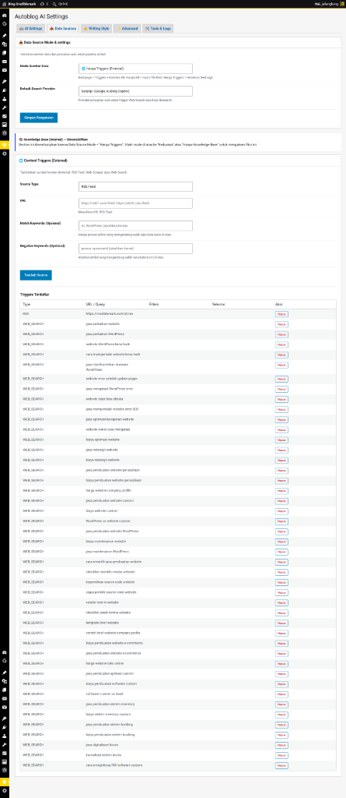
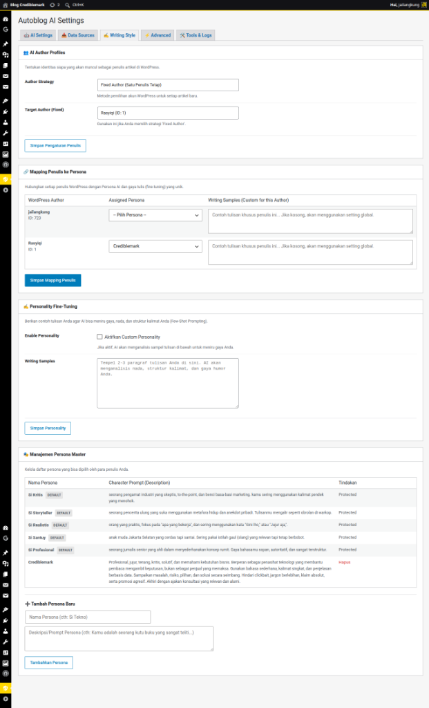
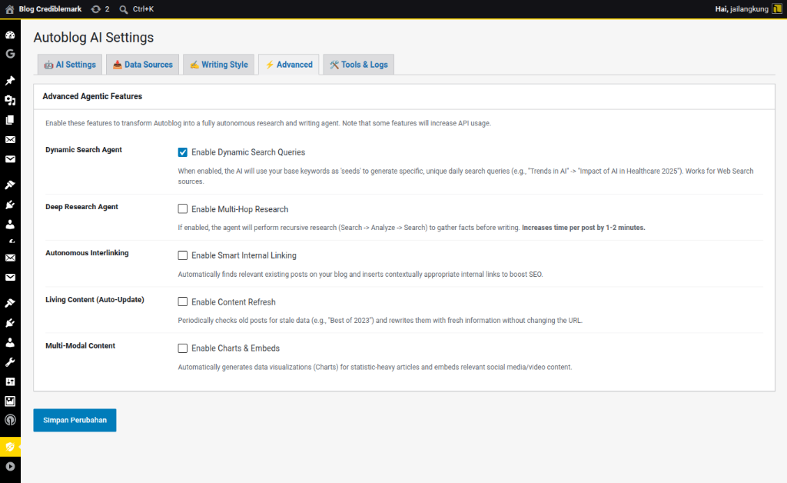
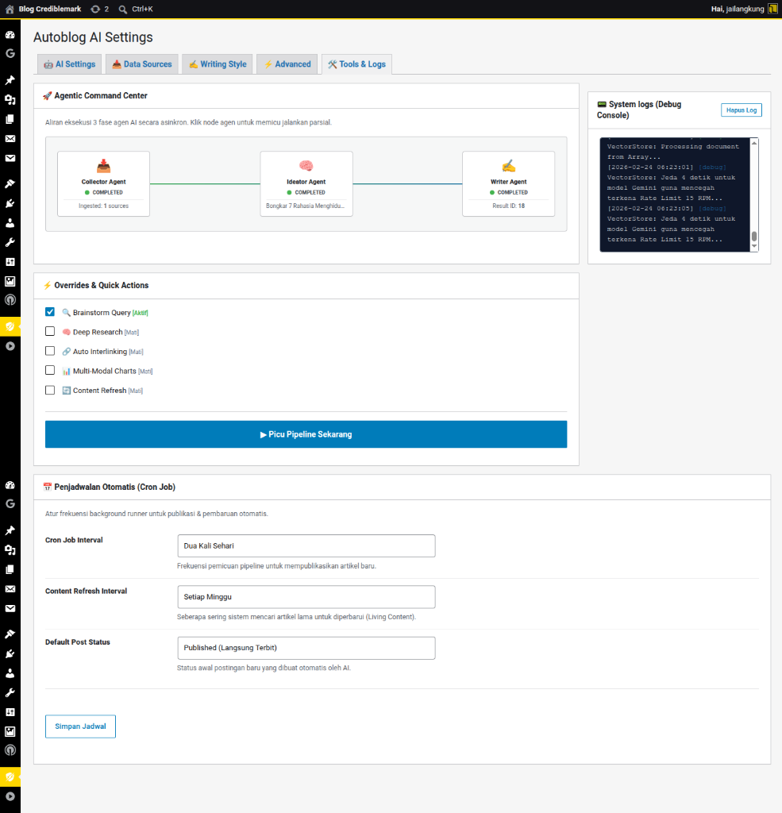
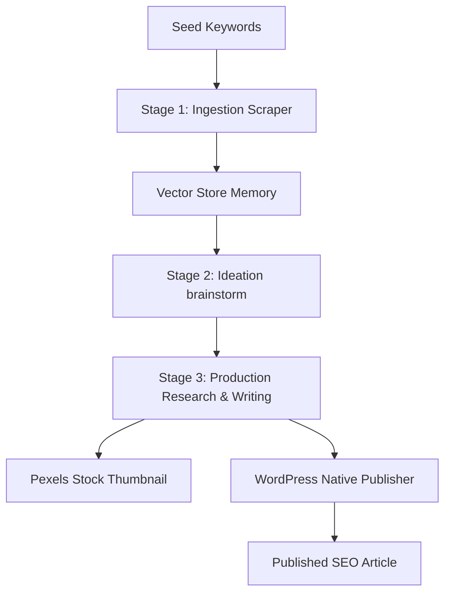

# Autoblog AI for WordPress 🤖✍️

[](https://wordpress.org)
[](https://php.net)
[](LICENSE)
[](https://github.com/rasyiqi-code/autoblog-ai-wordpress/actions/workflows/test.yml)
[](https://github.com/rasyiqi-code/autoblog-ai-wordpress/actions/workflows/phpcs.yml)
[](#)
[](#)

An intelligent, agentic autoblogging plugin for WordPress that automates content scraping, brainstorming, deep research, and high-quality SEO-optimized article publishing using advanced LLMs (OpenAI, Google Gemini, Hugging Face, etc.) and semantic search pipelines.

---

## 🌟 Key Features

- **Unified AI Engine Settings**: Select your active LLM provider using the radio button and configure individual AI models for each provider directly in the dynamic table.
- **Dynamic Credentials Table**: Add, remove, and manage API keys and custom endpoints for multiple providers simultaneously.
- **Intra-Provider Multi-API Key Rotation**: Input multiple API keys (one per line). The plugin automatically rotates to backup keys in the pool if the primary key hits a rate limit or quota depletion.
- **Custom Base URL (models.dev Integration)**: Fully customize API endpoints per provider. Default endpoints from `models.dev` are pre-filled as values for instant transparency.
- **Agentic Workflow Pipeline**:
  - **Stage 1 (Ingestion)**: Scrapes news, publications, and **RSS Feeds** dynamically based on seed keywords or RSS URLs using DuckDuckGo Free, SerpApi, or Brave Search.
  - **Stage 2 (Ideation)**: Brainstorms unique, non-trivial post ideas using semantic vector memory to avoid duplicate topics.
  - **Stage 3 (Production)**: Conducts multi-hop web research, compiles taxonomy (categories and tags), generates stock photo featured images (via Pexels/Openverse), and publishes the post.
- **Cross-Provider Smart Fallback**: Automatically switches to backup LLM providers (e.g. Gemini -> OpenAI) if the primary provider fails.
- **Knowledge Base Vector RAG**: Embeds reference documents (PDF, TXT, MD) and fetches context dynamically to improve factual accuracy.

---

## 🖥 Panduan Menu Dashboard Pengaturan (Admin Tabs)

Plugin ini dilengkapi dengan 5 tab pengaturan di halaman admin untuk mengontrol seluruh alur kerja robot penulis (AI Agent):

### 1. 🔑 API Keys (Pengaturan Kunci API & Model)



Di sini Anda mengatur "otak" AI yang akan digunakan untuk menulis:
* **Pilih Provider Aktif**: Cukup klik tombol bulat (radio button) di kolom **Aktif** untuk memilih provider utama (misal: Google Gemini atau OpenAI). Provider terpilih akan bertanda **AKTIF** (hijau), sedangkan yang lain menjadi **CADANGAN** (abu-abu).
* **AI Model Terpisah**: Setiap provider punya pilihan modelnya sendiri langsung di baris tabelnya. Anda bisa set Google Gemini menggunakan `gemini-2.5-pro` dan OpenAI menggunakan `gpt-4o-mini` tanpa saling mengganggu.
* **Rotasi Banyak API Key**: Anda bisa memasukkan banyak API key sekaligus di kolom **API Key(s)** (tulis satu key per baris). Jika key utama Anda limit atau habis kuota, AI akan otomatis memakai key baris di bawahnya tanpa membuat proses menulis berhenti.
* **Base URL Kustom**: Bisa digunakan jika Anda memakai proxy API, server lokal, atau model AI buatan sendiri. Nilai default bawaan dari `models.dev` sudah terisi otomatis.
* **Tombol Uji (Test Connection)**: Klik tombol **Test** di baris provider mana saja untuk langsung mengetes koneksi API key menggunakan model spesifik pilihan di baris tersebut.

### 2. 📥 Data Sources (Sumber Bahan Tulisan)



Menentukan dari mana AI akan mencari bahan referensi sebelum menulis artikel:
* **Mode Sumber Data (Source Mode)**:
  * *Keduanya*: AI akan membaca dokumen di Knowledge Base lokal Anda DAN mencari info tambahan dari internet/RSS.
  * *Hanya KB (Knowledge Base)*: AI hanya akan menulis artikel berdasarkan dokumen-dokumen yang Anda unggah saja (sumber internal).
  * *Hanya Triggers (External)*: AI menulis murni dari internet, RSS Feed, atau web scraper luar saja.
* **Knowledge Base (RAG)**: Unggah file dokumen referensi Anda di sini (mendukung `.xlsx`, `.csv`, `.pdf`, `.docx`, `.txt`, `.md`). Sistem akan memecah dokumen tersebut menjadi potongan memori vektor agar AI bisa menjawab dengan fakta yang tepat.
* **Content Triggers**: Mengatur pemantau konten otomatis:
  * **RSS Feed**: Mengambil berita dari feed RSS blog lain. Jika artikel di feed terlalu pendek, sistem otomatis akan pergi ke link asli dan mengekstrak artikel utamanya secara bersih menggunakan library `Readability`.
  * **Web Scraper**: Menyalin isi halaman web tertentu secara spesifik menggunakan CSS Selector (misalnya hanya mengambil elemen tag `<article>`).
  * **Web Search**: Menyuruh AI mencari topik terpopuler di DuckDuckGo atau SerpApi.
  * **Penyaring Kata Kunci**: Masukkan kata kunci wajib (*Include*) atau kata kunci pantangan (*Exclude*) untuk menyaring artikel agar relevan.

### 3. 👥 Writing Style (Gaya Penulisan & Penulis)



Mengatur "siapa" yang menulis dan "bagaimana" gaya bahasanya:
* **Strategi Penulis (Author Strategy)**: Tentukan akun WordPress mana yang dipasang sebagai penulis artikel baru:
  * *Random*: Diacak di antara user yang terdaftar.
  * *Round Robin*: Bergantian secara adil.
  * *Fixed Author*: Selalu ditulis oleh satu user WordPress yang sama.
* **Hubungkan Penulis ke Persona**: Anda bisa menugaskan Persona AI yang berbeda untuk setiap akun WordPress. Misalnya, akun Budi menggunakan gaya bahasa **Si Santuy**, sedangkan akun Jurnalis menggunakan gaya **Si Profesional**.
* **Personality Fine-Tuning**: Anda bisa menempelkan 2-3 paragraf contoh tulisan asli Anda (*Writing Samples*). Jika diaktifkan, AI akan meniru gaya bahasa, panjang kalimat, hingga gaya humor Anda agar tulisan terlihat lebih orisinal dan natural.
* **Pilihan Persona AI Bawaan**:
  * *Si Kritis*: Skeptis, langsung ke poin utama, benci bahasa iklan.
  * *Si Storyteller*: Mengalir, banyak metafora, seperti ngobrol santai di warkop.
  * *Si Realistis*: Praktis dan fokus pada solusi nyata ("Gini lho...").
  * *Si Santuy*: Bergaya bahasa kasual dan santai ala anak muda Jaksel yang tetap berbobot.
  * *Si Profesional*: Sopan, terstruktur, dan berwibawa layaknya jurnalis senior.

### 4. ⚙️ Advanced (Fitur AI Canggih)



Fitur-fitur tambahan untuk membuat AI bekerja seperti asisten jurnalis profesional:
* **Dynamic Search Agent**: AI tidak hanya mencari kata kunci yang Anda masukkan, tapi juga mengembangkannya secara dinamis menjadi kueri pencarian unik setiap hari (misal: "Tren AI" berkembang menjadi "Tren AI dalam Industri Kesehatan 2025").
* **Deep Research Agent (Riset Mendalam)**: AI akan mencari info di internet secara berulang-ulang (*multi-hop*), menganalisis data sementara, lalu mencari lagi sampai faktanya lengkap sebelum mulai menulis.
* **Autonomous Interlinking**: AI akan memindai artikel-artikel lama di blog Anda secara otomatis dan menyisipkan tautan (link) ke artikel tersebut di dalam postingan baru yang relevan untuk meningkatkan SEO.
* **Living Content (Update Otomatis)**: AI secara berkala akan membaca artikel lama Anda yang sudah usang dan menulis ulang isinya agar tetap segar tanpa mengubah tautan (URL) artikel tersebut.
* **Multi-Modal Content**: Secara otomatis membuat diagram/grafik visual jika artikel membahas data statistik, serta menyisipkan media/video yang relevan.

### 5. 🛠 Tools (Pusat Kendali Agen)



Halaman kontrol taktis untuk melihat kinerja robot AI secara real-time:
* **Visual Agent Flow Diagram**: Grafik visual yang menunjukkan status kerja 3 agen utama Anda: *Collector Agent* (pengumpul data), *Ideator Agent* (pembuat ide), dan *Writer Agent* (penulis artikel). Anda bisa mengklik ikon agen tersebut untuk menjalankannya secara manual.
* **Picu Pipeline Sekarang**: Tombol cepat untuk menyuruh AI langsung mulai mengumpulkan bahan, membuat ide, menulis, dan menerbitkan artikel detik ini juga tanpa menunggu jadwal cron.
* **Penjadwalan Otomatis (Cron)**: Mengatur frekuensi AI menulis otomatis (setiap jam, harian, mingguan, dsb.) dan status postingan default (Draft agar aman, atau langsung Terbit).
* **📟 System Logs (Debug Console)**: Menampilkan konsol log aktivitas teknis AI di balik layar secara langsung untuk melacak error atau memantau rotasi API key.

---

## ⚙️ Configuration & Installation

1. Upload the `autoblog-ai-wordpress` directory to your `/wp-content/plugins/` directory.
2. Activate the plugin through the **Plugins** menu in WordPress.
3. Navigate to **Autoblog AI** -> **🤖 AI Settings** in your WordPress admin panel.
4. Add your API credentials:
   - Click **`+ Tambah Key`** to select and add a provider (e.g., Google, OpenAI, Hugging Face).
   - Enter one or more API keys (one per line) in the **API Key(s)** textarea.
   - Select the radio button under the **Aktif** column on the provider you wish to use as the primary writer.
   - Choose the preferred **AI Model** directly from the dropdown menu in that provider's row.
   - Adjust other helper service keys (SerpApi, Pexels) in the credentials section below.
5. Click **Save Changes**.

---

## 🏗 Pipeline Architecture

The plugin executes an autonomous three-stage pipeline to generate authentic blog posts:



1. **Ingestion**: The system searches public indexes, extracts readable clean text, embeds the content, and stores it in a local JSON vector store.
2. **Ideation**: Queries the vector store to check previously covered topics. Brainstorms new, trending article titles that are semantically distinct.
3. **Production**: Uses a multi-round Research Agent to query search engines for facts, updates local taxonomies, inserts context via RAG, downloads featured images, and publishes the post.

---

## 🤖 CI/CD Pipeline

The plugin uses **GitHub Actions** for continuous integration. Every push and pull request automatically runs tests and coding standards checks.

### 📊 Workflow Status

| Workflow | Description | Badge |
|----------|-------------|:-----:|
| **PHPUnit Tests** | Runs all `@group unit` + `@group regression` tests on PHP 8.2 & 8.3 | [](https://github.com/rasyiqi-code/autoblog-ai-wordpress/actions/workflows/test.yml) |
| **PHP CodeSniffer** | Checks WordPress Coding Standards via `phpcs.xml.dist` | [](https://github.com/rasyiqi-code/autoblog-ai-wordpress/actions/workflows/phpcs.yml) |
| **Code Coverage** _(coming soon)_ | PHPUnit code coverage with Codecov / Coveralls | [](#) |

> **📌 Coverage Roadmap:** Next step is to integrate [Codecov](https://about.codecov.io/) or [Coveralls](https://coveralls.io/) and add `coverage: xdebug` to the PHP setup action. The test suite already supports `--coverage-clover` or `--coverage-html` output.

### 📁 `.github/workflows/test.yml` — PHPUnit Tests

| Aspect | Detail |
|--------|--------|
| **Trigger** | Push to `main`/`develop`, PR to `main` |
| **PHP Matrix** | `8.2` and `8.3` (fail-fast disabled) |
| **Coverage** | `none` (no code coverage service configured yet) |
| **Steps** | Checkout → Setup PHP → Cache Composer → Install → Run tests |

**Runs:**
- `--group unit` — All 22+ test files (every push)
- `--group regression` — Bug-prevention tests (PHP 8.3 only, every push)

### 📁 `.github/workflows/phpcs.yml` — PHP CodeSniffer

| Aspect | Detail |
|--------|--------|
| **Trigger** | Push/PR to `main` affecting `*.php`, `phpcs.xml.dist`, `composer.json` |
| **PHP** | `8.2` |
| **Standard** | `WordPress` with custom exclusions (see `phpcs.xml.dist`) |
| **PR Annotations** | Uses `cs2pr` to annotate violations inline on PR diffs |
| **Artifact** | Uploads `phpcs-report.xml` for download |

**Custom rules in `phpcs.xml.dist`:**

| Excluded Rule | Reason |
|---------------|--------|
| `WordPress.Files.FileName` | Plugin uses PSR-4 autoloading |
| `WordPress.NamingConventions.PrefixAllGlobals` | Namespace-based, not function prefix |
| `Generic.Files.LineLength` | Soft limit 180 / hard 200 (long AI prompts) |
| `WordPress.PHP.YodaConditions` | Project uses standard comparison operators |
| `WordPress.PHP.DevelopmentFunctions` | `error_log()` for debug logging |
| `WordPress.DB.PreparedSQL` | SQL concatenation in logging-only queries |
| `WordPress.WhiteSpace.DisallowSpaceIndent` | Project uses tabs |
| `Generic.WhiteSpace.ScopeIndent` | Relaxed indent for array nesting |

### 🛠️ Running CI Locally

```bash
# PHPUnit — all tests (mock fallback mode)
vendor/bin/phpunit

# PHPUnit — dengan real WordPress (setelah setup WP test suite)
export WP_TESTS_DIR=/tmp/wordpress-tests-lib-wordpress_test
vendor/bin/phpunit

# PHPUnit — by group
vendor/bin/phpunit --group unit
vendor/bin/phpunit --group regression

# PHP CodeSniffer
vendor/bin/phpcs

# Auto-fix minor style issues (experimental)
vendor/bin/phpcbf

# Coverage report (requires xdebug)
vendor/bin/phpunit --coverage-html coverage-report/
```

---

## 🧪 Testing & Development

The plugin features a comprehensive PHPUnit test suite with **970 tests across 50+ test files**, covering:
- WordPress Gutenberg block conversion & sanitization (PostManager)
- Vector store JSON persistence, atomic save, and semantic search (VectorStore)
- Multi-API key rotation & pool parsing (AICompletionTrait)
- Batch embedding & graceful degradation (AIEmbeddingTrait)
- AI client HTTP backoff, fallback, circuit breaker (AIClient)
- Search source URL validation & keyword filtering (SearchSource)
- RSS feed source validation & keyword pass/filter (RSSSource)
- File source constructor & validation (FileSource)
- Web scraper source: CSS selector → XPath, Readability fallback, keyword filter
- Article content cleaning, markdown & taxonomy extraction (ArticleWriter)
- Pipeline ingestion, filtering, ideation, production (Runner)
- Pipeline cron scheduling & interval management (UpdateScheduler)
- Author assignment strategies: random, round-robin, fixed (AuthorManager)
- Interlinker relevance scoring & link injection (Interlinker)
- Model catalog fallback chain & dynamic model detection (ModelCatalog)
- OptionCache get/set/delete/invalidate/flush (OptionCache)
- Admin: menu registration, enqueue styles/scripts, upload handler, CRUD sources
- ContentRefresher: WP_Query stale detection, DI mocks, guard logic
- IdeationAgent: internal dedup, title uniqueness
- ResearchAgent: multi-phase research, empty question handling
- Logger file creation, rotation, and timestamping (Logger)
- ChartGenerator URL construction & chart type configuration (ChartGenerator)
- DataSizer content filtering & date sorting (DataSizer)
- Cosine similarity pure function (VectorStore internal)
- ContentTransformer: angle injection at median position

---

## ⚙️ Dual-Mode Test Bootstrap

The test suite supports **two modes** of operation:

| Mode | Bootstrap | Prasyarat | Kecepatan | Akurasi |
|------|-----------|-----------|:---------:|:-------:|
| **🔹 Mock Fallback** *(default)* | `tests/mocks.php` | PHP + Composer saja | ⚡ Cepat | 🟡 Terbatas (mocked WP) |
| **🔸 WordPress Test Suite** | `WP_TESTS_DIR` env | MySQL + bin/install-wp-tests.sh | 🐢 Lambat | 🟢 Real WordPress |

### Cara Kerja Bootstrap

`tests/bootstrap.php` otomatis mendeteksi mode yang digunakan:

```php
// Pseudocode alur bootstrap:
if ( getenv('WP_TESTS_DIR') && file_exists(WP_TESTS_DIR . '/includes/functions.php') ) {
    // Mode 1: Load WordPress asli + plugin
    require WP test suite bootstrap
    require autoblog.php via muplugins_loaded hook
} else {
    // Mode 2: Load mock functions (fallback)
    require tests/mocks.php
}
```

**Mode Mock Fallback** cocok untuk:
- Development cepat (tanpa database)
- CI/CD pipeline (GitHub Actions)
- Isolasi bug spesifik

**Mode WordPress Test Suite** cocok untuk:
- Verifikasi akhir sebelum rilis
- Test integrasi dengan real WordPress API
- Mengonfirmasi kompatibilitas WordPress

---

## 🚀 Running Tests

### Prerequisites
- PHP **8.2+** with extensions: `mbstring`, `xml`, `curl`, `json`, `gd`, `dom`
- Composer dependencies installed (`composer install`)

### Basic Commands

```bash
# Run all 970 tests (mock fallback mode)
vendor/bin/phpunit

# Run only unit tests
vendor/bin/phpunit --group unit

# Run only regression tests (bug-prevention)
vendor/bin/phpunit --group regression

# Run all tests except regression
vendor/bin/phpunit --exclude-group regression

# Filter by class name
vendor/bin/phpunit --filter PostManagerTest
vendor/bin/phpunit --filter CosineSimilarityTest

# Filter by method name
vendor/bin/phpunit --filter test_atomic_save
vendor/bin/phpunit --filter test_cross_provider_fallback

# Combine filter + group
vendor/bin/phpunit --group regression --filter VectorStore

# List available tests
vendor/bin/phpunit --list-tests

# Generate HTML coverage report (requires xdebug)
vendor/bin/phpunit --coverage-html coverage-report/
```

### 💻 Setup for Local by Flywheel (WordPress Test Suite Mode)

Local by Flywheel sudah memiliki PHP + MySQL bawaan. Ikuti langkah berikut untuk setup **WordPress Test Suite**:

#### 1. Cari PHP Binary

```bash
# Cari Local PHP binary
ls ~/.config/Local/lightning-services/ | grep php
# Contoh output: php-8.2.29+0

# Set variabel untuk memudahkan
PHP=~/.config/Local/lightning-services/php-8.2.29+0/bin/linux/bin/php
export LD_LIBRARY_PATH=~/.config/Local/lightning-services/php-8.2.29+0/bin/linux/shared-libs:$LD_LIBRARY_PATH
```

> **Catatan:** Versi PHP tergantung versi PHP yang dipilih di Local. Sesuaikan path-nya.

#### 2. Install WordPress Test Suite

```bash
# Pindah ke direktori plugin
cd ~/"Local Sites/dev/app/public/wp-content/plugins/autoblog-ai-wordpress"

# Install test suite + create test database
bash bin/install-wp-tests.sh wordpress_test root root localhost
```

Script ini akan:
- Membuat direktori `/tmp/wordpress-tests-lib-wordpress_test/`
- Download WordPress core + test suite includes
- Membuat database `wordpress_test`
- Konfigurasi `wp-tests-config.php` dengan kredensial yang diberikan

#### 3. Jalankan Test dengan Real WordPress

```bash
# Set environment variable
WP_TESTS_DIR=/tmp/wordpress-tests-lib-wordpress_test

# Jalankan test!
$PHP vendor/bin/phpunit --no-coverage
```

Saat `WP_TESTS_DIR` diset, bootstrap akan load **WordPress asli** (bukan mock).

#### 4. (Opsional) Handle Platform Check

Jika PHP Local lebih lawas dari requirement composer:

```bash
# Patch platform_check.php (kembali normal setelah composer install ulang)
sed -i 's/PHP_VERSION_ID >= 80300/PHP_VERSION_ID >= 80200/' vendor/composer/platform_check.php
```

---

## 🧱 Test Infrastructure

### `tests/mocks.php` — Mock Functions

Berisi ~50 mock functions WordPress yang digunakan saat **Mock Fallback Mode**. Semua mock menggunakan `function_exists()` guard agar tidak konflik dengan real WordPress.

**Fitur call tracking:**

Beberapa mock functions secara otomatis melacak panggilan via `$GLOBALS['_wp_mock_calls']`:

| Function | Tracked In |
|----------|------------|
| `add_menu_page`, `add_submenu_page` | `_wp_mock_calls['add_menu_page']` |
| `wp_enqueue_style`, `wp_enqueue_script` | `_wp_mock_calls['wp_enqueue_style']` |
| `wp_localize_script`, `wp_add_inline_script` | `_wp_mock_calls['wp_localize_script']` |
| `wp_dequeue_script`, `wp_add_dashboard_widget` | `_wp_mock_calls['wp_dequeue_script']` |
| `WP_Query::__construct` | `_wp_mock_calls['WP_Query::__construct']` |
| `media_sideload_image` | `_wp_mock_calls['media_sideload_image']` |

**Controllable return values:**

| Global Variable | Function Affected |
|-----------------|-------------------|
| `$GLOBALS['_wp_mock_calls']['get_current_screen_return']` | `get_current_screen()` |
| `$GLOBALS['_autoblog_mock_media_sideload_return']` | `media_sideload_image()` |
| `$_autoblog_mock_options` | `get_option()`, `update_option()`, `delete_option()` |
| `$_autoblog_mock_wp_query_posts` | `WP_Query::$posts` |

### `tests/bootstrap.php` — Auto-Detect Bootstrap

```php
// Alur:
// 1. WP_TESTS_DIR diset? → Load WordPress asli
// 2. WP_TESTS_DIR tidak diset? → Load mocks.php
```

### `bin/install-wp-tests.sh` — Test Suite Installer

Script standar WordPress untuk mengunduh dan menginstal test suite:

```bash
bash bin/install-wp-tests.sh <db-name> <db-user> <db-pass> [db-host]
```

| Parameter | Default | Deskripsi |
|-----------|---------|-----------|
| `db-name` | `wordpress_test` | Nama database test |
| `db-user` | `root` | User MySQL |
| `db-pass` | `root` | Password MySQL |
| `db-host` | `localhost` | Host MySQL |

---

## 🧩 Writing New Tests

### Basic Test Structure

```php
<?php

namespace Autoblog\Tests;

use PHPUnit\Framework\TestCase;
use Autoblog\Utils\OptionCache;

/**
 * @group unit
 * @group regression  // Hanya untuk mencegah bug spesifik
 */
class MyNewTest extends TestCase {

    protected function setUp(): void {
        parent::setUp();
        OptionCache::flush();
        global $_autoblog_mock_options;
        $_autoblog_mock_options = [];
    }

    protected function tearDown(): void {
        global $_autoblog_mock_options;
        $_autoblog_mock_options = [];
        OptionCache::flush();
        parent::tearDown();
    }

    public function test_example() {
        global $_autoblog_mock_options;
        $_autoblog_mock_options['my_option'] = 'test_value';

        $result = some_function();
        $this->assertEquals( 'expected', $result );
    }

    // Helper untuk akses private/protected method
    private function invokeMethod( $object, string $methodName, array $parameters = [] ) {
        $reflection = new \ReflectionClass( get_class( $object ) );
        $method     = $reflection->getMethod( $methodName );
        $method->setAccessible( true );
        return $method->invokeArgs( $object, $parameters );
    }
}
```

### Testing WordPress Admin Functions

Untuk test yang perlu memverifikasi pemanggilan WordPress functions (seperti `add_menu_page`, `wp_enqueue_style`, dll):

```php
public function test_admin_menu_registered() {
    $admin = new Admin( 'autoblog', '1.1.9' );
    $admin->add_plugin_admin_menu();

    // Cek call tracking
    $calls = $GLOBALS['_wp_mock_calls']['add_menu_page'] ?? [];
    $this->assertCount( 1, $calls );
    $this->assertSame( 'Autoblog AI', $calls[0][1] ); // menu_title
}
```

### Testing with Controllable WP_Query

Untuk test yang perlu mengontrol hasil `WP_Query`:

```php
public function test_wp_query_params() {
    // Set mock posts
    $GLOBALS['_autoblog_mock_wp_query_posts'] = [
        (object) [ 'ID' => 42, 'post_title' => 'Test', 'post_content' => 'Content' ],
    ];

    $result = some_function_that_uses_wp_query();

    // Cek parameter query
    $args = $GLOBALS['_wp_mock_calls']['WP_Query::__construct'][0];
    $this->assertEquals( 'post', $args['post_type'] );
    $this->assertEquals( 5, $args['posts_per_page'] );
}
```

### Testing media_sideload_image

Untuk test yang menggunakan `media_sideload_image()`:

```php
public function test_media_upload() {
    // Kontrol return value
    $GLOBALS['_autoblog_mock_media_sideload_return'] = 42;

    $result = some_function();
    $this->assertSame( 42, $result );

    // Atau simulasikan error
    $GLOBALS['_autoblog_mock_media_sideload_return'] = new \WP_Error( 'upload_error', 'Gagal' );
}
```

### Testing get_current_screen Behavior

Untuk test yang perlu mengubah nilai `get_current_screen()`:

```php
public function test_taxonomy_page_detection() {
    // Ubah screen return
    $GLOBALS['_wp_mock_calls']['get_current_screen_return'] = (object) [
        'id' => 'posts_page_autoblog-taxonomy-tools',
    ];

    $result = some_function_using_current_screen();
    $this->assertTrue( $result );
}
```

### Key Patterns to Follow

- ✅ **Always** call `OptionCache::flush()` in `setUp()`
- ✅ **Reset** `$_autoblog_mock_options` in both `setUp()` and `tearDown()`
- ✅ **Use** `@group unit` for all tests
- ✅ **Use** `@group regression` for bug-prevention tests only
- ✅ **Use** `invokeMethod()` helper to test private/protected methods
- ✅ **Clean up** `$GLOBALS['_wp_mock_calls']` in `tearDown()` if your test modified it

---

## 🔍 Troubleshooting

| Masalah | Penyebab | Solusi |
|---------|----------|--------|
| `PHP Fatal error: Uncaught Error: Call to undefined function add_action()` | `mocks.php` tidak ter-load | Pastikan `tests/bootstrap.php` dijalankan |
| `Undefined constant ABSPATH` | `ABSPATH` tidak didefinisikan | Mock fallback sudah mendefinisikannya otomatis di `mocks.php` |
| `Class "WP_Error" not found` | Class mock tidak terdefinisi | Load `mocks.php` di bootstrap (otomatis) |
| `Call to undefined method ...::getTitle()` | Readability library namespace mismatch | `fivefilters/Readability` (lowercase) — sudah diperbaiki di WebScraperSource |
| `ZipArchive not found` | PHP extension `zip` tidak aktif | Aktifkan extension zip di Local PHP settings |
| `Base table or view not found` | Test database belum dibuat | Jalankan ulang `bin/install-wp-tests.sh` |
| `WP_TESTS_DIR` not working | Environment variable tidak terbaca | Export dulu: `export WP_TESTS_DIR=/tmp/wordpress-tests-lib...` |

---

## 📁 Test Files & Groups

| Test File | Groups | Tests | Coverage |
|-----------|--------|:-----:|----------|
| `AdminTest` | `unit` | 35 | Menu, enqueue, upload, CRUD sources, gateway proxies |
| `PostManagerTest` | `unit` | 7 | Gutenberg block conversion, HTML sanitization, UTF-8 |
| `KeyRotationTest` | `unit`, `regression` | 2 | Multi-API key parsing, empty pool |
| `VectorStoreTopicsTest` | `unit` | 6 | get_recent_topics(), title truncation |
| `VectorStorePersistenceTest` | `unit`, `regression` | 8 | Atomic save, JSON load/clear, summary |
| `VectorStoreSearchIntegrationTest` | `unit`, `regression` | 10 | search() with mock, cosine similarity, limit |
| `ArticleWriterTest` | `unit` | 6 | clean_text(), markdown_to_html(), taxonomy JSON |
| `SearchSourceTest` | `unit` | 10 | URL prefix, validation, keyword filters, cookies |
| `FileSourceTest` | `unit`, `regression` | 6 | Constructor, validate, fetch, CSV/xlsx parse |
| `WebScraperSourceTest` | `unit`, `regression` | 10 | Property declaration, URL validation, display name |
| `WebScraperSourceFetchTest` | `unit`, `regression` | 25 | CSS selector → XPath, Readability fallback, filtering |
| `RunnerSourcesTest` | `unit`, `regression` | 6 | get_configured_sources(), array filter, null handling |
| `RunnerTest` | `unit` | 2 | Exception handling in ingestion & production |
| `RunnerPipelineTest` | `unit` | 2 | Ideation phase throws, production rethrows |
| `EmbeddingBatchTest` | `unit`, `regression` | 11 | create_embeddings_batch(), provider dispatch |
| `AIClientFallbackTest` | `unit`, `regression` | 8 | get_fallback_model(), provider chain, priority |
| `AIClientTest` | `unit` | 3 | HTTP backoff retry (429, 500, 400) |
| `AICompletionTest` | `unit` | 3 | Insertion, completion, query API |
| `AIEmbeddingTest` | `unit` | 3 | Embedding endpoint, batch, single text |
| `RSSSourceTest` | `unit` | 6 | Validation, filter keyword, display name |
| `RSSSourceFilterTest` | `unit` | 8 | Partial word, comma-separated keywords |
| `AuthorManagerStrategyTest` | `unit` | 6 | pick_author() strategies, persona data |
| `AuthorManagerTest` | `unit` | 3 | Constructor, CRUD, option integration |
| `InterlinkerTest` | `unit` | 28 | get_relevant_posts(), inject_links(), edge cases |
| `ModelCatalogTest` | `unit`, `regression` | 8 | get_active_model() fallback chain: custom → global → provider |
| `UpdateSchedulerTest` | `unit` | 7 | Cron intervals, schedule/unschedule, reschedule |
| `OptionCacheUnitTest` | `unit` | 8 | Get/set/delete/invalidate/flush |
| `LoggerTest` | `unit` | 6 | File creation, rotation >5MB, timestamp, level |
| `ChartGeneratorTest` | `unit` | 8 | URL construction, chart types, config encoding |
| `DataSizerTest` | `unit` | 6 | Filter content length, sort by date, null handling |
| `CosineSimilarityTest` | `unit`, `regression` | 18 | Identical, opposite, orthogonal, dimension mismatch |
| `ContentCleanerTest` | `unit` | 12 | HTML/script/style removal, boilerplate, nbsp |
| `ContentRefresherTest` | `unit` | 22 | Guard, WP_Query args, DI mocks, phase 3 flow |
| `IdeationAgentTest` | `unit` | 3 | Title dedup, topic generation |
| `ResearchAgentTest` | `unit` | 12 | Multi-phase research, empty handling, error handling |
| `AngleInjectorTest` | `unit` | 7 | HTML cleaning, truncation, content transformation |
| `ContentTransformerTest` | `unit` | 2 | Angle injection at median position |
| `ThumbnailGeneratorTest` | `unit` | 23 | Pexels/Openverse/DALL-E search, save to media library |
| `BraveDriverTest` | `unit` | 3 | HTTP error handling, empty content |
| `SerpApiDriverTest` | `unit` | 1 | HTTP error handling |
| `DuckDuckGoDriverTest` | `unit` | 4 | HTML parse, WP error → Guzzle fallback |
| `SearchSourceIntegrationTest` | `unit` | 4 | Brave/SerpApi request format, duckduckgo fallback |
| `VectorStoreDocumentTest` | `unit` | 3 | Chunk text splitting, sentence boundary, whitespace |
| `VectorStoreSummaryTest` | `unit` | 1 | Summary dedup identical sources |
| `VectorStorePersistenceTest` | `unit` | 7 | Store directory creation, JSON marshalling |
| `VectorStoreTopicsTest` | `unit` | 6 | Recent topics structure, sorting, limit |
| `ActivatorTest` | `unit` | 2 | Activation/deactivation hooks |
| `AutoblogTest` | `unit` | 16 | Constructor, getters, hooks registration |
| `AutoblogBootstrapTest` | `unit` | 2 | Constants, functions definition |
| `LoaderUnitTest` | `unit` | 4 | Add action/filter, runner registration |
| `DataSizerTest` | `unit` | 3 | Filter, sort, edge cases |

## 📄 License
 
This project is licensed under the GPL-2.0-or-later License - see the [LICENSE](LICENSE) file for details.
